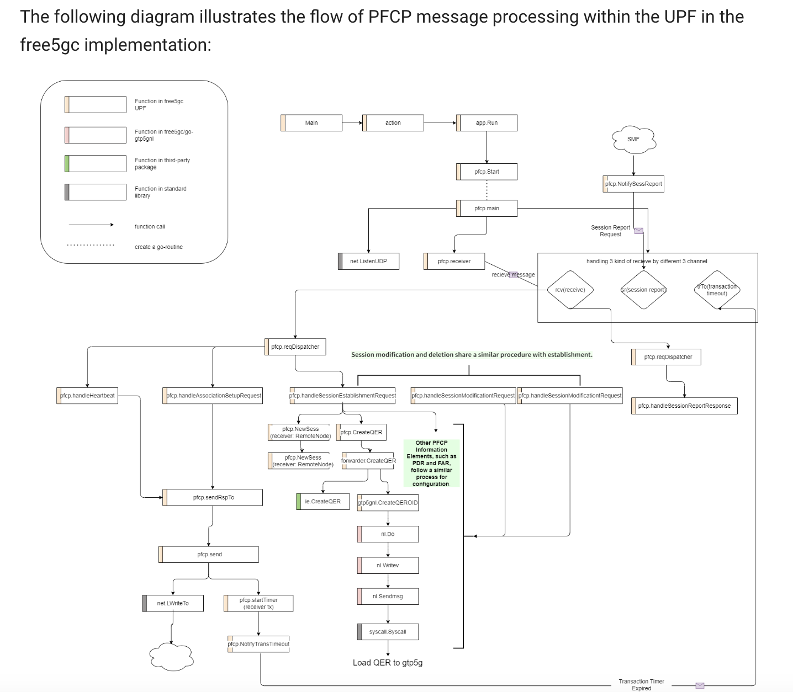

# AMF
## Introduction
AMF plays a critical role in managing User Equipment(UE) registration, connectivity, reachability and mobility. It interact with other network functions(NF) such as **UDM**, **SMF** and **AUSF**


## UE context
UE context refers to a collection of data maintained by the AMF about a specific UE. This data is essential for managing the UE's connection to the network. **Namf_Communication** service enables an NF to communicate with the UE through **AN**(RAN, Radio Access Network, in 5G it is usually called gNB)
## Call Flow
- First is a registration process. gNB sends registration requests along with an initial UE message to RAN, which sends request to AMF. 这种request叫做（R）AN message，其包括registration type，SUCI，Last visited TAI， Requested NSSAI等信息。Then it checks for the last AMF with which the UE is registered, and if it succeeds to find the old AMF address, the new AMF requests for the UE context procedure.
- AMF authenticates UE and at the same time the network initiates the deregistration process against the old AMF. And it also retrieves all the subscriber-related data from **UDM** and session-related subscriber data from SMF.
- Finally it creates UE context. It allocates UE with an id known as AMF UE NGAP ID to identify it from a pool of UEs. And then registration confirmation message with an initial context setup message is sent.
## Authorization && Authentication
这个过程由**call ausf**而引发
AMF initiates authorization and authentication procedure with the UE. And then AUSF handles the authentication-related parameters. AMF builds protected NAS UL and DL transport channels before any type of communication between UE, gNB, and AMF.

## PDU Session Establishment/Modification
PDU Session modification request is sent by SMF to UPF. And then AMF accordingly updates the UE context and passes the updated parameters and information to the gNB and UE to reconfigure its base.


# UPF
## Introduction
UPF plays a crucial role in data transfer within the 5G network. It is interconnected with the **Data Network(DN)** in the 5G architecture. As a primary network function(NF) of the 5G core network(5GC), it handles the most critical aspects of data processing. 
## Function
- packet routing and forwarding
- packet inspections
- quality of service(QoS) handling
- anchor point for intra & inter-RAT mobility

## Codebase run

- Data Plane Forwarder for GTP-U: This procsee establishes a data path for forwarding user data packets between the UPF and the UE via GTP-U protocol
- PFCP Server: This process establishes a control plane connection with the SMF using the PFCP protocol.


## Interfaces
- N3: Interface between RAN and the UPF based on the **GTP-U** protocol.
- N4: Interface between Session Management Function(SMF) and the UPF based on the PFCP protocol
- N6: Interface between DN and UPF.
- N9: Interface between two UPFs.

The free5GC implements UPF in two parts
- Control plane: **GO-UPF**(N4)
- Data plane: **GTP5G**(N3,N6,N9)

**GTP** 
GTP(General Packet Radio System Tunneling Protocol) is a group of IP-based communication protocols used to transport General Packet Radio Services(GPRS) within LTE, 5G NR, and other networks. GTP can be broken down into 3 components: GTP-C(Control plane), GTP-U(User plane) and GTP prime.

---

> **Notice**<br>
GTP is protocol<br>
gtp5g is kernel module to implement GTP<br>

---

## GTP5G Architecture
It is divided two parts, gtp in UPF and gtp5g, they are golang language in UPF and bash in linux respectively. In UPF gtp, GO-UPF configuration is done to connection with gtp5g, which utilizes a linux kernel module to manage packet traffic. In gtp5g, the primary function is gtp5g_init in gtp5g.c.


- 1. GO-UPF configuration
    - NewDriver()
        - It is for initializing a GTP5G device for handling **uplink**(UE to gNB) and **downlink**(gNB to UE) packets, as well as configuring routes for this decice.
        - Driver provides functions to communicate with gtp5g. So when UPF receives a PFCP message, it parses the content and then uses various functions of the Driver to instruct gtp5g to take regarding rules.

            - Create/Update/Remove **PDR**
            - Create/Update/Remove **FAR**
            - Create/Update/Remove **QER**
            - Create/Update/Remove **URR**
            - Create/Update/Remove **BAR**


    - OpenGtp5gLink()
        - It passes the UDP Socket representing N3. The gtp5g module then uses this socket to establish a UDP tunnel for N3.
        - UPF use NETLINK_ROUTE in rtnl(RtNetlink) to config Gtp5glink.
        - Finally a device(network interface) called upfgtp including MTU is created.
    - OpenServer()
        - Connect UPF Driver functions and gtp5g_genl_ops


    - RouteAdd()
        - Add the corresponding route for the **D6 Downlink**, it indicates all of the traffic, sent to UE, will proceed by the gtp5g network device.
        ```bash
        func (g *Gtp5gLink) RouteAdd(dst *net.IPNet) error{
            // type IPNet struct{IP, Mask}
            r := &rtnlroute.Request{
                Header: rtnlroute.Header{

                    Table:    syscall.RT_TABLE_MAIN,
			        Scope:    syscall.RT_SCOPE_UNIVERSE,
			        Protocol: syscall.RTPROT_STATIC,
			        Type:     syscall.RTN_UNICAST,
                },
                err := r.AddDst(dst)
                if err != nil{
                    return err
                    }
                err = r.AddIfName(g.link.Name)
                if err != nil{
                    return err
                }
                return rtnlroute.Create(g.client, r)

            }
        }

        ```
- 2. Initialize gtp5g kernal module.
    - create_proc()
        - The proc filesystem is a **virtual** filesystem that allows **userspace programs** to access kernel data structures and state. DBG, FAR, PDR, QER are created
        
        ```bash

        proc_gtp5g = proc_mkdir("gtp5g", NULL);
        if(!proc_gtp5g){
            GTP5G_ERR(NULL,"Failed to create /proc/gtp5g\n");
            goto unreg_pernet;
        }

            proc_gtp5g_dbg = proc_create("dbg", (S_IFREG | S_IRUGO | S_IWUGO),
        proc_gtp5g, &proc_gtp5g_dbg_ops);
        if (!proc_gtp5g_dbg) {
        GTP5G_ERR(NULL, "Failed to create /proc/gtp5g/dbg\n");
        goto remove_gtp5g_proc;
	}
        ...

        ```
    - net_device_ops
        - It is defined in dev.h and referenced in dev.c. The structure net_device_ops encompasses all operations related to network device, and free5GC inherits some of these opeations to implement self-made netdev ops.
    - register_pernet_subsys()
        - This function is to register a pernet subsystem, which is a framework for managing network **namespace**.
    - generic family
        - This structure is used to define a generic netlink family, which is a way for **userspace programs** to communicate with the kernel.
        - gtp5g defines **gtp5g_genl_ops**, all operations are one-to-one match to Driver functions in UPF, including PDR, FAR, QER and URR.
        
        ```bash
        
        struct genl_family gtp5g_genl_family _ro_after_init = {
            .name   =   "gtp5g",
            .version    =   0,
            .ops    =   gtp5g_genl_ops
            ...
        }

        static const struct genl_ops gtp5g_genl_ops[] = {
            {
                .cmd = GTP5G_CMD_ADD_PDR,
                .doit = gtp5g_genl_add_pdr,
                .flags = GENL_ADMIN_PERM,
            },
            {
                .cmd = GTP5G_CMD_DEL_PDR,
                .doit = gtp5g_genl_del_pdr,
                .flags = GENL_ADMIN_PERM,
            }
        }

        ```
        

    - rtnl_link_ops
        - This structure is used to define operations related to network devices.
        - Once rtnl link setting up, gtp5g would assign net_device_ops to device.
        - Once register success, UPF can create new network device(interface) using Rtnetlink socket.

        ```bash
        <!-- /link.c -->
        struct rtnl_link_ops gtp5g_link_ops _read_mostly = {
            .kind   = "gtp5g",
            .setup  = gtp5g_link_setup,
            ...
        }
        ```

        These functions in rtnl_link_ops are **Hooks**
    

- 3. Uplink initialization
    - gtp5g_newlink()**
        - It includes gtp5g_dev, gtp5g_net and socket.
        - The two main called functions **gtp5g_encap_enable** and **register_netdevice**
        - It is used to build N3 UDP tunnel(**bind udp socket**) and **register** a new gtp5g device
        ```bash

        static int gpt5g_newlink(struct net *src_net, struct net_device *dev, struct nlattr *tb[], struct nlattr *data[], struct netlink_ext_ack *extack){
            struct gtp5g_dev *gtp;
            struct gtp5g_net *gn;
            ...
            err = register_netdevice(dev);
                    }


        ```
    - gtp5g_encap_enable()
        - Bind UDP socket for receiving N3 packet.
- 4. Uplink transmission
    - gtp5g_encap_recv()
        - This function is responsible for handling the UDP tunnel receiving packer.
    - gtp1u_udp_encap_recv()
        - The function handles packets encapsulated by GTP protocol.
    - netif_rx()
        - Provided by the kernel, to send the packets through N6 interface.
    
- 5. Downlink initialization
    - gtp5g_link_setup()
        - Define how gtp5g processes the packet from N6 interface. And these operations will be assigned to gtp5g link device when initiallized.
        ```bash
        static void gtp5g_link_setup(struct net_device *dev){
            dev->netdev_ops = &gtp5g_netdev_ops;
            dev->needs_free_netdev = true;
            dev->mtu = ETH_DATA_LEN-(sizeof(struct iphdr) +
         sizeof(struct udphdr) +
         sizeof(struct gtpv1_hdr));
            ...
        }
        ```
        
    - gtp5g_netdev_ops:
        - It is a structure that defines how gtp5g deals with N6 packets.
    - gtp5g_dev_init():
        - This function is called once when a network device is registered. The network device can use the for any late stage initialization or semantic validation. It can fail when an error code which will be **propagated back to register_netdev**.
        ```bash
        const struct net_device_ops gtp5g_netdev_ops = {
            .ndo_init   =   gtp5g_dev_init,
            .ndo_uninit =   gtp5g_dev_unitit,
            ...
        }

        ```
        - It is called after the net device is registered and initializes some of the device's status
    - gtp5g_dev:
        -   define network device
        -   define socket
        -   define pdr and qer
        ```bash
        struct gtp5g_dev{
            struct list_head    list;
            struct sock         *sk1u;
            struct net_device   *dev;
            unsigned int        role;
            ...
        }
        ```

- 6. Downlink transmission
    - gtp5g_dev_xmit():
        - This function is defined by **gtp5g_netdev_ops** so it is called when a packet needs to be transmitted.
        
    - gtp5g_handle_skb_ipv4():
        - The FAR will then be checked to determine how to handle the packet after querying the PDR based on the destination IP
        ```bash
        far = pdr->far;
        if(far){
            switch(far->action & FAR_ACTION_MASK){
                case FAR_ACTION_DROP;
                    return gtp5g_drop_skb_ipv4(skb, dev, pdr);
                case FAR_ACTION_FORW:
                    return gtp5g_fwd_skb_ipv4(skb,dev,pktinfo,pdr);
                ...
            }
        }

        ```
    - gtp5g_xmit_skb_ipv4():
        - This function will be called and packets will be sent to the UDP tunnel after FAR action is confirmed.(if **far->action == FAR_ACTION_FORW**)
        ```bash
        static void gtp5g_xmit_skb_ipv4(struct sk_buff *skb, struct gtp5g_ptkinfo *ptinfo){
            udp_tunnel_xmit_skb(pktinfo->rt, pkinfo->sk, skb, ...)
        }

        ```
        
## PFCP
PFCP empowers SMFs to Setup associations with UPFs, essnentially creating control paths for directin user data traffic. Following association, SMF leverage PFCP to configure Packet Data Unit(PDU) sessions within the UPF. This PDU sessions dictate how user data should be processed and forwarded across the network.


### Association Setup
- PFCP server initialization
The pfcp.Start function in the free5gc UPF codebase initiates the PFCP server and **Setup** a listening UDP socket for receiving PFCP message from the SMF. Golang stack including select statement is used to monitor three channels.
    - Channel 1: Session report: pfcp.NotifySessReport function is called by the SMF to send session report through this channel.
    - Channel 2: Receive packet: pfcp.receive function parses the UDP message and then sends the data through this channel.
    - Channel 3: Transaction timeout: Any packet sent by UPF will start a timeout timer, when timer expires, pfcp.NotifyTransTimeout will send a signal through this channel to trigger re-transmission.
    
- Association Request
pfcp.main function calls pfcp.reqDispatcher function when **UPF receives an association request** by SMF. And then this dispatcher assigns pfcp.handleAssociationSetupRequest to handle it, in which address and is verified before added to the " remote note list"

### PDU Session establishment

PDU Session Request procedure is similar to assoication establishment procudure.

- SMF sends establishment request
- pfcp.main in UPF calles pfcp.reqDispatcher, which assigns pfcp.handleSessionEstablishmentRequest fucntion to handle it.
- Remote node ID is checked whether thie SMF has been associated with UPF.
- Then UPF control plane creates a PDU session by using F-SEID
- Afterwards, the UPF begins creating PDU session in the data plane, by transferring information elements from the PFCP message, such as QER,FAR and PDR, to the kernel module gtp5g.

---

> **Notice**<br>
> QER(Quality of Experience Rule)<br>
> FAR(Forwarding Action Rule)<br>
> PDR(Packet Detection Rule)<br>

---


## gpt5g
### Netlink
Netlink is an IPC(Inter Process Communication) protocol which can connect kernel space and user space processes by socket. Traditionally, it used three methods: **loctl**, **sysfs**, or **procfs** to facilitate communication between the kernel and user space. 
#### Function
- Initiated from user space(not from kernel space)
- Bidirectional transmission, asynchronous communication
- Standard socket API used in kernel space
- Specialized API used in kernel space
- Support for multicast
- Support for 32 protocol types

### Generic Netlink


### RtNetlink
User space program could read and alter kernel's routing table or create new network device(**network interface**).


### gpt5g in UPF
- Driver provides functions to communicate with gtp5g. So when UPF receives a PFCP message, it parses the content and then uses various functions of the Driver to instruct gtp5g to take regarding rules.

    - Create/Update/Remove **PDR**
    - Create/Update/Remove **FAR**
    - Create/Update/Remove **QER**
    - Create/Update/Remove **URR**
    - Create/Update/Remove **BAR**

- UPF use rtnl(RtNetlink) to create device(interface) named upfgtp. 
- Connect UPF Driver functions and gtp5g_genl_ops


---

> **Notice**: 
> - **register_netdev(dev)**
> dev = alloc_netdev(sizeof(struct gtp5g_priv), "gtp5g%d", NET_NAME_UNKNOWN, gtp5g_setup);<br>
> dev->netdev_ops = &gtp5g_netdev_ops;  
> register_netdev(dev);  

> - **register_rtnl_link_ops(&gtp5g_link_ops)**

> - **genl_register_family(&my_genl_family)**
> 
```bash
    static struct genl_ops my_genl_ops[] = {
    {
        .cmd = MY_CMD_HELLO,
        .flags = 0,
        .policy = my_genl_policy,
        .doit = my_genl_doit,
        .dumpit = NULL,
    },
    static struct genl_family my_genl_family = {
    .name = "my_family",            // Netlink 家族名称
    .version = 1,                   // 版本号
    .maxattr = MY_ATTR_MAX,         // 属性的最大数量
    .ops = my_genl_ops,             // 指向 genl_ops 数组
    .n_ops = ARRAY_SIZE(my_genl_ops), // genl_ops 数量
};
 ret = genl_register_family(&my_genl_family);
```
---

