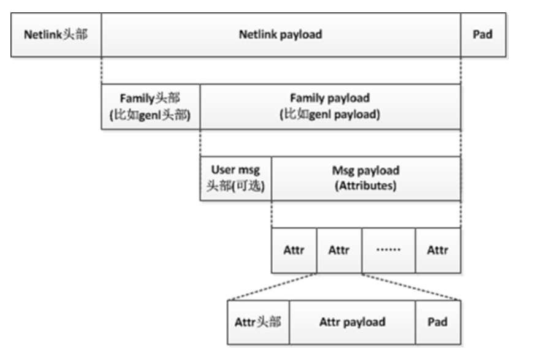

# Important Data Structure in Networking Programming
## sk_buff
### Function
- The most frequently allocated and freed structrue in the network subsystem
- This structure is used from L2 to L4, which each layer modifying the field.(adding headers)
### Structure

```bash

struct sk_buff {
    /* These two members must be first. */
    struct sk_buff          *next;
    struct sk_buff          *prev;

    struct sock             *sk; // This field is needed for socket-related data at L4. It is null if the host is neither the destination nor the source.
    struct net_device       *dev;

    char                    cb[48] __aligned(8); // Control buffer

    unsigned long           _skb_refdst;
    void                    (*destructor)(struct sk_buff *skb);
#ifdef CONFIG_NET_DMA
    struct dma_chan         *dma_chan;
    dma_cookie_t            dma_cookie;
#endif
    /* Data */
    unsigned char           *head; // Points to buffer head
    unsigned char           *data; // Points to data head
    unsigned char           *tail; // Points to data end
    unsigned char           *end;  // Points to buffer end
    unsigned int            len;   // Changes as this structure exists at different layers. When moving up the layers, headers are discarded.
    unsigned int            data_len; // Only contains the size of the data
    unsigned int            mac_len;
    unsigned short          gso_size;
    unsigned short          csum_offset;

    __u32                   priority; // Used for QoS
    __u32                   mark;
    __u16                   queue_mapping;
    __u16                   protocol; // Used by the driver to determine which handler at a higher level should process the packet (each protocol has its own handler)
    __u8                    pkt_type;
    __u8                    ip_summed;
    __u8                    ooo_okay;
    __u8                    nohdr;
    __u8                    nf_trace;
    __u8                    ipvs_property;
    __u8                    peeked;
    __u8                    nfctinfo;
    __u8                    napi_id;

    __be32                  secmark;

    union {
        __wsum              csum;
        struct {
            __u16           csum_start;
            __u16           csum_offset;
        };
    };

    __u16                   vlan_proto;
    __u16                   vlan_tci;

#ifdef CONFIG_NET_CLS_ACT
    __u32                   tc_index;       /* Traffic control index */
#endif

#ifdef CONFIG_NET_SCHED
    __u16                   tc_verd;        /* Traffic control verdict */
#endif

    __u16                   tstamp;
    __u16                   hash;
    __u32                   timestamp;

    struct sk_buff          *frag_list;
    struct sk_buff          *next_frag;

    skb_frag_t              frags[MAX_SKB_FRAGS];
    skb_frag_t              frag_list;

    struct ubuf_info        *ubuf_info;

    struct skb_shared_info  *shinfo;
};

```

- net_device 
    - kinds
        - wireless card
        - ethernet card
        - loopback 'lo'
    - key fields
        - flags
        - mtu
        - net_device_ops
- cb(control buffer)
    - It is used to store temporary and private data in each layer.
    - For example
        - IP

        ```bash
        struct ip_skb_cb {
        __u32    addr;
        __u32    options;
        // Other temporary information for the IP layer
        };
        void ip_process(struct sk_buff *skb) {
        struct ip_skb_cb *cb = IP_CB(skb);
            cb->addr = ...;
            cb->options = ...;
             // Process the IP packet
        }
        ```
        - TCP
        ```bash
        struct tcp_skb_cb {
        union {
        struct {
            __u32  seq;       /* TCP sequence number */
            __u32  end_seq;   /* TCP end sequence number */
            union {
                struct {
                    __u16  flag;       /* TCP flags */
                    __u16  sacked;     /* SACKed status */
                };
                __u32  ack_seq;        /* Acknowledgment sequence number */
            };
        };
        __u8  header[48];    /* Align to 48 bytes */
            };
            __u32  when;             /* Transmission time */
            __u32  acked;            /* ACKed status */
            };
        ```
        - Access using macro
        ```bash
        
        #define TCP_SKB_CB(__skb)   ((struct tcp_skb_cb *)&((__skb)->cb[0]))

        ```

        - Example
        ```bash

        #include <linux/skbuff.h>
        #include <net/tcp.h>
        void process_tcp_skb(struct sk_buff *skb) {
        struct tcp_skb_cb *tcb = TCP_SKB_CB(skb);
        // Set TCP sequence number
        tcb->seq = 1000;
        // Set TCP end sequence number
        tcb->end_seq = 2000;
        // Set TCP flags
        tcb->flag = 0x10;  // For example, ACK flag
        // Print TCP sequence number and end sequence number
        printk(KERN_INFO "TCP seq: %u, end_seq: %u\n", tcb->seq, tcb->end_seq);
        }
        ```

## Netlink
### Function
Netlink emerged as a more versatile solution specifically designed for network communication. It offers a message-based approach with features like reliable delivery, multicast support, and flexible data strcuture.
- Simplified flow
```bash

/*
 *  <------- NLA_HDRLEN ------> <-- NLA_ALIGN(payload)-->
 * +---------------------+- - -+- - - - - - - - - -+- - -+
 * |        Header       | Pad |     Payload       | Pad |
 * |   (struct nlattr)   | ing |                   | ing |
 * +---------------------+- - -+- - - - - - - - - -+- - -+
 *  <-------------- nlattr->nla_len -------------->
 */

fd = socket(AF_NETLINK, SOCK_RAW, NETLINK_GENERIC);

/* format the request */
send(fd, &request, **sizeof**(request));
n = recv(fd, &response, RSP_BUFFER_SIZE);
/* interpret the response */

```

- Netlink message format
```bash

Netlink Message
   |-- Netlink Message Header
   |   |-- Message Length (nlmsg_len)
   |   |-- Message Type (nlmsg_type)
   |   |-- Message Flags (nlmsg_flags)
   |   |-- Sequence Number (nlmsg_seq)
   |   |-- Sender Process ID (nlmsg_pid)
   |   |-- Message Group ID (nlmsg_group)
   |-- Netlink Message Payload
   |   |-- (Data specific to the message type)
   |-- Padding

---

struct nlmsghdr {
 __u32  nlmsg_len; /* Length of message including header */
 __u16  nlmsg_type; /* Message content */
 __u16  nlmsg_flags; /* Additional flags */
 __u32  nlmsg_seq; /* Sequence number */
 __u32  nlmsg_pid; /* Sending process port ID */
};

---

```

- GENERIC NETLINK
Generic netlink is a higher layer than netlink, like udp to ip. 

    - **genlmsghdr** It is header of Generic Netlink Payload, also called Family header, while nlmsghdr is header of Netlink payload.
    ```bash
    struct nlmsghdr{
        _u32 nlmsg_len;     //Length of message including header
        _u16 nlmsg_type;    
        _u16 nlmsg_flags;
        _u32 nlmsg_seq;
        _u32 nlmsg_pid;

    }

    ```
    - **family** 
    ```bash
    struct genl_family{
        unsigned int id;
        unsigned int hdrsize;
        ...
        struct list_head ops_list;
        struct list_head family_list;
    }
    
    ```
    - genl_ops
    ```bash
    struct genl_ops{
        u8 cmd;
        unsigned int flags;
        struct nla_policy *policy;
        int (*doit) ...
    }
    ```
    -- doit is callback function. **cmd** is name of function, to identify every genl_ops.
    The two parameters carried by **doit** are **skb** and **genl_info** 
    -- genl_info
    ```bash
    struct genl_info
    {
        u32 snd_seq;
        u32 snd_pid;
        struct nlmsghdr *nlhdr;
        struct genlmsghdr *genlhdr;
        void *userhdr;
        struct nlattr ** attrs;
    }

    - example(server)
    ```bash 
    int genl_recv_doit(struct sk_buff *skb, struct genl_info *info){
        struct nlmsghdr *nlhdr;
        struct genlmsghdr *genlhdr;
        struct nlattr *nla;
        int len;
        char *str;
        nlhdr = mlmsg_hdr(skb);
        genlhdr = nlmsg_data(nlhdr); //get header of genlnetlink
        nla = genlmsg_data(genlhdr) //get payload of genlnetlink
        str = (char *)NLA_DATA(nla) //The user data is attr 
    }
    int genl_msg_send_to_user(void *data, int len, pid_t pid){
        struct sk_buff *skb;
        void *head;
        int rc;
        // create netlink header and genl netlink header. EXMPL_C_ECHO is cmd.
        rc = genl_msg_prepare_usr_msg(EXMPL_C_ECHO, size, pid, &skb);
        // create payload of genl netlink. 
        rc = genl_msg_mk_usr_msg(skb, EXMPL_A_MSG, data, len);
        rc = genlmsg_unicast(&init_net, skb, pid);
    }
    static inline int genl_msg_prepare_usr_msg(u8 cmd, size_t size, pid_t pid, struct sk_buff **skbp){
        struct sk_buff *skb;
        //create a new netlink msg
        skb = genlmsg_new(size, GFP_KERNER);

        //Calls nlmsg_put() on the specified message object to reserve space for the Netlink header, the Generic Netlink header, and a user header of specified length. Fills out the header fields with the specified parameters.

        genlmsg_put(skb, pid, 0, &exmpl_gnl_family, 0, cmd);
        *skbp = skb;
        return 0;
    }
    static inline int genl_msg_mk_usr_msg(struct sk_buff *skb, int type, void *data, int len){
        int rc;
        // add a netlink attribute and data to a socket buffer
        if((rc == nla_put(skb, type, len, data)) ! = 0 ){
            return rc;
        }
        return 0;
    }


    ```
    - example(client)
    ```bash
    //create socket
    sock_fd = socket(AF_NETLINK, SOCK_RAW, NETLINK_GENERIC)
    //bind socket
    struct socketaddr_nl src_addr, dest_addr;
    memset(&src_addr, 0, sizeof(src_addr));
    src_addr.nl_family = AF_NETLINK;
    src_addr.nl_pid = 1234;
    //Bind
    retval = bind(sock_fd, (struct sockaddr*)&src_addr, sizeof(src_addr));
    int genl_send_msg(){
        msg.nlh.nlmsg_len = NLMSG_LENGTH(GENL_HORLEN);
        msg.nlh.nlmsg_type = family_id;
        msg.nlh.nlmsg_flags = NLM_F_REQUEST;
        ...
        na = (struct nlattr *) GENLMSG_DATA(&msg);
        na->nla_type = nla_type;
        nla->nla_len = nla_len + 1 + NLA_HDRLEN;
        msg.nlh.nlmsg_len += NLMSG_ALIGN(na->nla_len);
        buf = (char *) &msg;
        buflen = msg.nlh.nlmsg_len;
        dst_addr.nl_family = AF_NETLINK;
        dst_addr.nl_pid = 0;
        while((r=sendto(sock_fd, buf, buflen, 0, (struct sockaddr * ) &dst_addr, sizeof(dst_addr))) < buflen){
            if(r>0){
                buf += r;
                buflen -= r;
            }
            else if(errno != EAGAIN){
                return -1;
            }
        }
        return 0;
        
    }


    ```

- type of netlink message
    - NETLINK_ROUTE(used to control network routes, ip address, link parameters)
    - NETLINK_NETFILTER
    - NETLINK_KOBJECT_UEVENT
    - NETLINK_GENERIC

- rtnl_link_register && rtnl_link_ops
This function is used in linux kernel to register a new kind of network device(interface), with parameter of rtnl_link_ops, including creating, deleting and configging.
```bash


int err = rtnl_link_register(&gtp5g_link_ops);
if (err) {
    printk(KERN_ERR "Failed to register gtp5g link ops: %d\n", err);
    return err;
}

---

static struct rtnl_link_ops gtp5g_link_ops __read_mostly = {
    .kind         = "gtp5g",
    .maxtype      = IFLA_GTP5G_MAX,
    .policy       = gtp5g_policy,
    .priv_size    = sizeof(struct gtp5g_dev),
    .setup        = gtp5g_link_setup,
    .validate     = gtp5g_validate,
    .newlink      = gtp5g_newlink,
    .dellink      = gtp5g_dellink,
    .get_size     = gtp5g_get_size,
    .fill_info    = gtp5g_fill_info,
    };


---

```

- rtnetlink socket
It is used in way of bash to manage network device. And it is an interface provided by subnetwork of linux system. 

```bash

#include <stdio.h>
#include <stdlib.h>
#include <string.h>
#include <unistd.h>
#include <sys/socket.h>
#include <linux/netlink.h>
#include <linux/rtnetlink.h>
#include <netinet/in.h>

int main() {
    int sockfd;
    struct sockaddr_nl addr;
    struct {
        struct nlmsghdr nlh;
        struct ifinfomsg ifm;
        char buf[1024];
    } req;

    // 创建 Netlink 套接字
    sockfd = socket(AF_NETLINK, SOCK_RAW, NETLINK_ROUTE);
    if (sockfd < 0) {
        perror("socket");
        exit(EXIT_FAILURE);
    }

    memset(&addr, 0, sizeof(addr));
    addr.nl_family = AF_NETLINK;

    if (bind(sockfd, (struct sockaddr*)&addr, sizeof(addr)) < 0) {
        perror("bind");
        close(sockfd);
        exit(EXIT_FAILURE);
    }

    // 构建 Netlink 消息
    memset(&req, 0, sizeof(req));
    req.nlh.nlmsg_len = NLMSG_LENGTH(sizeof(struct ifinfomsg));
    req.nlh.nlmsg_type = RTM_NEWLINK;
    req.nlh.nlmsg_flags = NLM_F_REQUEST | NLM_F_CREATE | NLM_F_EXCL;
    req.nlh.nlmsg_seq = 1;
    req.nlh.nlmsg_pid = getpid();
    req.ifm.ifi_family = AF_UNSPEC;

    // 填充网络设备名称
    struct nlattr *nla;
    int len = req.nlh.nlmsg_len;
    nla = (struct nlattr *)NLMSG_DATA(&req);
    nla->nla_len = NLA_ALIGN(sizeof(uint32_t) + strlen("test0") + 1);
    nla->nla_type = IFLA_IFNAME;
    strcpy((char *)NLA_DATA(nla), "test0");
    len += nla->nla_len;

    if (sendto(sockfd, &req, len, 0, (struct sockaddr*)&addr, sizeof(addr)) < 0) {
        perror("sendto");
        close(sockfd);
        exit(EXIT_FAILURE);
    }

    // 接收响应
    char buf[4096];
    struct msghdr msg = {0};
    struct iovec iov = { buf, sizeof(buf) };
    msg.msg_iov = &iov;
    msg.msg_iovlen = 1;
    msg.msg_name = &addr;
    msg.msg_namelen = sizeof(addr);

    ssize_t len_recv = recvmsg(sockfd, &msg, 0);
    if (len_recv < 0) {
        perror("recvmsg");
        close(sockfd);
        exit(EXIT_FAILURE);
    }

    // 处理响应
    struct nlmsghdr *nlh;
    for (nlh = (struct nlmsghdr*)buf; NLMSG_OK(nlh, len_recv); nlh = NLMSG_NEXT(nlh, len_recv)) {
        if (nlh->nlmsg_type == NLMSG_DONE) {
            break;
        }
    }

    close(sockfd);
    return 0;
}

```


## 根据自己定义的结构体发送message
以发送pdi消息为例
```bash
// define pdi struct
typedef struct {
    uint8_t sourceInterface;
    uint32_t localField;
    char networkInstance[16];
    char ueIPAddressp16;
}
void serializePDI(const PDI *pdi, uint8_y *buffer, size_T *size){
    size_t offset = 0;
    buffer[offset++] = pdi->sourceInterface;
    // 序列化 Local F-TEID
    memcpy(buffer + offset, &pdi->localField, sizeof(pdi->localField);
    // 序列化 Network Instance
    memcpy(buffer + offset, pdi->networkInstance, sizeof(pdi->networkInstance));
    offset += sizeof(pdi->networkInstance);
    
    // 序列化 UE IP Address
    memcpy(buffer + offset, pdi->ueIPAddress, sizeof(pdi->ueIPAddress));
    offset += sizeof(pdi->ueIPAddress);
    
    *size = offset;
    )
}

// 发送message
void sendPDIMessage(const char *ip, uint16_t port, const PDI *pdi){
    int sockfd;
    struct sockaddr_in server_addr;
    uint8_t bufferp[256];
    size_t buffer_size;
    // 创建套接字
    sockfd = socket(AF_INET, SOCK_DGRAM, 0);
    if (sockfd < 0) {
        perror("Socket creation failed");
        return;
    }

    // 填充目标地址
    memset(&server_addr, 0, sizeof(server_addr));
    server_addr.sin_family = AF_INET;
    server_addr.sin_port = htons(port);
    if (inet_pton(AF_INET, ip, &server_addr.sin_addr) <= 0) {
        perror("Invalid address");
        close(sockfd);
        return;
    }

    // 序列化 PDI 消息
    serializePDI(pdi, buffer, &buffer_size);

    // 发送消息
    if (sendto(sockfd, buffer, buffer_size, 0, (struct sockaddr*)&server_addr, sizeof(server_addr)) < 0) {
        perror("Send failed");
    }

}
```

## register my_ioctl
```bash

#define DEVICE_NAME "my_device"
#define IOCTL_CMD_HELLO _IO('a' , 1)
static logn my_ioctl(struct file *file, unsigned int cmd, unsigned long arg){
    switch (cmd){
        case IOCTL_CMD_HELLO:
            printk(KERN_INFO "Hello from ioctl!\n");
            break;
        default:
            return -EINVAL;
    }
    return 0;
}
static int my_open(struct inode *inode, struct file *file){
    return 0;
}
....
static struct file_operations fops = {
    .owner = THIS_MODULE,
    .open = my_open,
    .releae = my_release,
    .read = my_read,
    .write = my_write,
    .unlocked_ioctl = my_ioctl,
}
static int _init my_module_init(void){
...
}
module_init(my_module_init);
...


```
## ioctl && ifreq
To be simple, ifreq is like a intermediate data to be called by ioctl to configure network devices. 
### ifreq
```bash
struct ifreq{
    chr ifr_name[IFNAMSIZ];
    union{
        struct sockaddr ifr_addr;
        //只针对点对点连接的目标地址
        struct sockaddr ifr_dstaddr;
        struct sockaddr ifr_broadaddr;
        ... 
    }
}

```
### ioctl
use ioctl to call **SIOCGIFMTU** and so on to config the network device
```bash

#include <stdio.h>
#include <stdlib.h>
#include <string.h>
#include <unistd.h>
#include <sys/ioctl.h>
#include <sys/types.h>
#include <sys/socket.h>
#include <net/if.h>
#include <arpa/inet.h>

int main(int argc, char *argv[]) {
    if (argc != 3) {
        fprintf(stderr, "Usage: %s <interface> <mtu>\n", argv[0]);
        return 1;
    }

    const char *interface = argv[1];
    int new_mtu = atoi(argv[2]);

    if (new_mtu <= 0) {
        fprintf(stderr, "Invalid MTU value\n");
        return 1;
    }

    int sockfd = socket(AF_INET, SOCK_DGRAM, 0);
    if (sockfd < 0) {
        perror("socket");
        return 1;
    }

    struct ifreq ifr;
    memset(&ifr, 0, sizeof(ifr));
    strncpy(ifr.ifr_name, interface, IFNAMSIZ - 1);
    ifr.ifr_mtu = new_mtu;

    if (ioctl(sockfd, SIOCSIFMTU, &ifr) < 0) {
        perror("ioctl");
        close(sockfd);
        return 1;
    }

    printf("MTU for interface %s set to %d\n", interface, new_mtu);

    close(sockfd);
    return 0;
}


```

## **/proc** interface
### file_operations 
```bash

static const struct file_operations gtp5g_proc_fops = {
    .owner  =   THIS_MODULE,
    .open   =   gtp5g_proc_open,
    .read   =   seq_read,
    .release    =   single_release,
}

static int gtp5g_proc_open(struct inode *inode, struct file *file){
    return  single_open(file,gtp5g_proc_show,NULL);
}
...

```

### Create **/proc** file
```bash
proc_file = proc_create(PROC_NAME, 0, NULL, &gtp5g_proc_fops);

```


## Socket
### socket

```bash
int socket(int domain, int type, int protocol);

```
domain: AF_INET, AF_INET6, AF_UNIX(processes in localhost)
type: SOCK_STREAM, SOCK_DRGAM, SOCK_RAW
protocol: normally 0

### sockaddr
It consists of address family(ipv4/ipv6) and address
```bash
struct sockaddr{
    sa_family_t sa_family;
    char    sa_data[];
}

```
### in_addr
```bash
struct in_addr {
  union {
    struct {
      u_char s_b1;
      u_char s_b2;
      u_char s_b3;
      u_char s_b4;
    } S_un_b;
    struct {
      u_short s_w1;
      u_short s_w2;
    } S_un_w;
    u_long S_addr;
  } S_un;
};
```
例in_addr = 192.168.1.1
- S_un
    - S_un_b.s_b1 = "192"
    - S_un_b.s_b2 = "168"
    - S_un_b.s_b3 = "1"
    - S_un_b.s_b4 = "1"
- S_un_w
    - S_un_w.s_w1 = 192.168
    - S_un_w.s_w2 = 1.1
- S_addr = 192168001001
### sockaddr_in
It extend sockaddr with port
```bash
struct sockaddr_in{
sa_family_t sin_family;
in_port_t   sin_port;
struct in_addr  sin_addrs;

}

```
### sendto
```bash
int sock_fd
sock_fd = socket(AF_NETLINK, SOCK_RAW, NETLINK_GENERIC);
char *buf;
int buflen;
family_id = genl_get_family_id(sock_fd, "myfamily")
data = (char*)malloc(256)
memset(data, 0,256)
strcpy(data,"Hello);
genl_send_msg(sock_fd, family_id, 1234, EXMPL_C_ECHO, 1, EXMPL_A_MSG,(void *)data, strlen(data)+1);

int genl_send_msg(int sock_fd, family_id, nlmsg_pid, genl_cmd, genl_version, nla_type, void *nla_data, int nla_len){
    msgtemplate_t msg;
    msg.nlh.nlmsg_len = NLMSG_LENGTH(GENL_HDRLEN);
    msg.nlh.nlmsg_type = family_id;
    ...
    msg.gnlh.cmd = genl_cmd;
    na = (struct nlattr*) GENLMSG_DATA(&msg);
    na->nla_type = nla_type;
    na->nla_len = nla_len + 1 + NLA_HDRLEN;
    memcpy(NLA_DATA(na),nla_data,nla_len);
    buf = (char *) &msg;
    buflen = msg.nlh.nlmsg_len;
    while((r = sendto(sock_fd, buf, buflen, 0 , (struct sockaddr *) &dst_addr, sizeof(dst_addr))) < buflen){
        if(r>0){
            buf += r;
            buflen -= r;
        }
        else if(errno != EAGAIN){
            return -1;
        }
    }


}

```
## Interrupt & Driver
### Definition 
When an interface receives a packet, the driver, device, and the kernel work together using interrupts to handle the packet. The detailed process is as follows:
- Device Receives Packet:
The network interface card(NIC) or network device receives the packet and converts it to an electrical signal
- Device Generates Interrupt:
The device sends an interrupt signal to the CPU to indicate that a packet has arrived.
- CPU Acknowledge Interrupt:
CPU halts its current tasks and identifies the interrupt source using the interrupt vector table.
- CPU Executes ISR:
The CPU runs the Interrupt Service Routine from the driver layer to handle the interrupt, which processes the incoming packet.
- Driver Processes Packet:
The ISR passes the packet information to the driver, which processes it, such as parsing headers and handling data.
- Kernel Processes Packet:
The driver may pass the packet to the kernel for the further processing, such as routing and TCP/IP handling.
- CPU Resumes Tasks:
After packet processing, the CPU resumes its previous tasks.
### dev_queue_xmit && ndo_start_xmit
dev_queue_xmit is called in Data Link Layer, responsible for encapsulating data frame, and then sending it to physical device. And then ndo_start_xmit is used as network device driver to process these data.
dev_queue_xmit -> ndo_start_xmit
```bash
int dev_queue_xmit(struct sk_buff *skb){
    struct net_device *dev = skb->dev;
    struct netdev_queue *txq;
    struct Qdisc *q;
    int rc = -ENOMEN;
    // 关闭软中断
    rcu_read_lock_bh();
    // 将数据包放在cpu中队列中处理。需要网卡支持多队列。txq = TX Queue
    txq = dev_pick_tx(dev, skb);
    //从netdev_queue结构上获取设备的qdisc（队列调度器）
    q = rcu_dereference_bh(txq->qdisc);
    if(q->enqueue){
        rc = __dev_xmit_skb(skb, q, dev, txq);
        goto out;
    }
    ...
    rcu_read_unlock_bh();
}


```
txq->qdisc是一个调度器，也可以称为**排队规则**（FIFO），倘若有enqueue规则话就会直接进入到拥塞的flow中。
> 不管有没有拥堵，最后的数据包都是通过**dev_hard_start_xmit**发送的
如果满足一下则不用enqueue，而是直接通过sch_direct_xmit来发送
- q->flags是TCQ_F_CAN_BYPASS，这个默认条件是可以的
- qlen即队列长度为0，那么当前的skb理应是第一个skb
- qdisc本来是非running的状态，现在成功置位Running
如果拥塞的话一般来说是qlen！=0，则进行enqueue操作，然后调用dev_hard_start_xmit来循环发送skb，这里有用到xmit_one函数，其嵌套了好几层函数。
xmit_one -> netdev_start_xmit -> __netdev_start_xmit -> ops->ndo_start_xmit

> **Notice**<br>
> In Linux, the kernel typically does not have direct access to packets stored in a **device's queue** due to security layers that prevent unauthorized access. When a device receives a packet, it is stored in a queue until the driver processes it. The kernel accesses packet information **only through the driver layer**, which provides interfaces for packet retrieval.<br>


