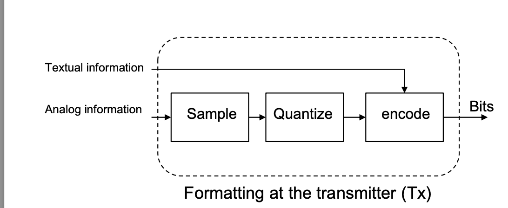
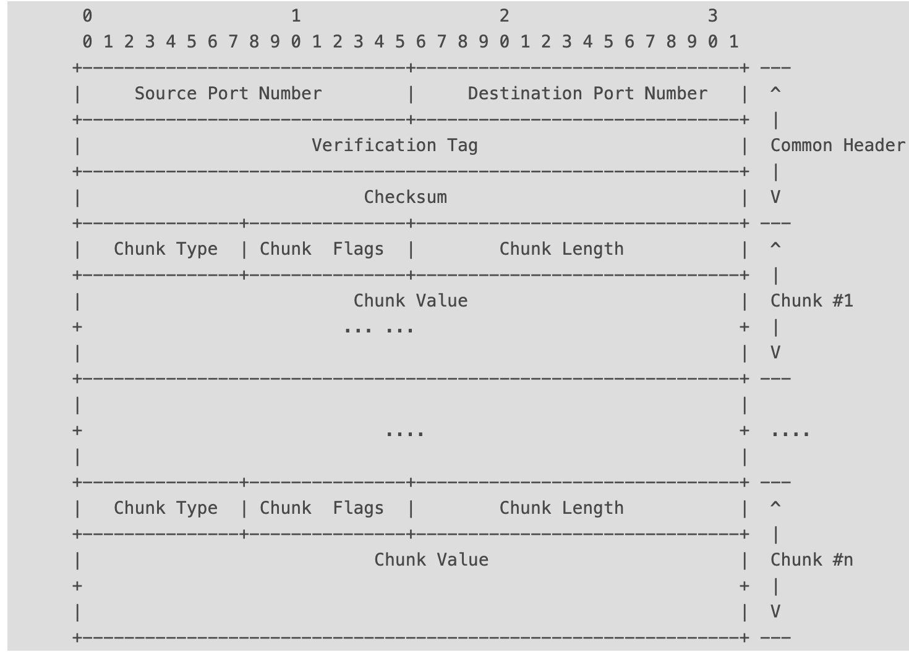

# Physical Layer
## Different Representations of Signals
- Amplitude(Time Domain)
- Frequency Spectrum(Frequency Domain)
- Phase State Diagram(Amplitude and Phase)
## Data Transmission
### Format
Analog Information goes through Sampling and Quantizing to convert to Bits, while Textual Information(JSON) goes through Encode to convert to Bits


### Line Codes
Line Code is baseband waveform, also called Voltage Level.
#### Forms
- Binary Line Code
- M-ary Line Code

### Passband Transmission
#### Step
- Transform Line Code to Baseband(Complex) symbols(Methods: ASK, FSK, PSK, QAM)
- Shifts Center Frequency of Baseband Signal up to the Radio Carrier(加载到高频进行传输)

### Channel Capacity
- Nyquist Bound
由于那奎斯特理论认为最大W=2C，然而一个采样中有log2M个bits，因此C = 2Wlog2M
- Shannon Bound
香农理论认为C受限于信噪比，因此C = Wlog2(1+S/N)

# Frame
## Definition
A frame is the basic unit of data transmission at the **Data link layer**(L2) in the OSI model and is responsible for reliable data transfer between two directly connected nodes. 
## Main Components
- Frame Header: Destination MAC Address and Source MAC Address. Type/Length Field, Control Information. Normally, the frame type is Ethernet, so we enter IPv4/IPv6/ARP
- Payload/Data: The actual transmitted data from higher layer.
- FCS, Frame Check Sequence
- Trailer
## Function
- Transmitter: Data link layer receive packet from network layer, and then encapsulate it with Frame Header, and transmit to physical layer.
- Receiver: Data link layer receives frame from physical layer, and then chect it with FCS, and decapsulates to higher layer.
## MTU
MTU(Maximum Transmission Unit) is associated with the Data Link Layer, to defines the maximum size of data packet.
For example, in **Ethernet** the standard MTU is typically 1500 bytes, meaning that the largest IP packet(including headers) that can be transmitted without fragmentation is 1500 bytes. If a packet exceeds the MTU, it must be fragmented at the Network Layer(Layer 3) to fit into smaller frames.


# Packet
## Definition
A packet is the basic unit of data transmission at the **network layer** in the OSI model.
## Main Components
- Header: Source and Desination IP addresses, protocol type(**IP**).
- Payload: The actual data transported
- Trailer
## Function
- Routing: Packets are forwarded through the network from the source to the destination using routers which can determine the best path.
- Fragmentation and Reassembly: Large packers might be split into smaller fragements for transmission across networks with smaller maximum transmission units(**MTUs**)

# Segment(TCP and UDP)
## Definition
- It is basic for data transmission at the **transport layer** in the OSI model, to deal with the transport of data between two systems.
## Main Components
- Header: Contains information like source and destination port numbers, sequence number, acknowledgment number, flags(e.g., SYN, ACK) and window size.
- Payload: The actual data being sent.
## Function
- Data Integrity
- Flow Control
- Error Detection and Correction.

# Message or Chunk(SCTP)
## Definition
It is basic for data transmission at SCTP, which is based on stream of data, to send data catagories like video.
## Main Components
- Header: Contains Source Port Number, Destination Port Number, Checksum
- Chunk
    - Chunk Type
    - Chunk Length
    - Chunk Value



# Socket(tcp udp)
## Definition
- It is an interface or *****endpoint** *****that facilitates establishing and managing a TCP or UCP connection, enabling applications to send and receive data.
## Components
- An IP address
- A port number
## Function
- Establish, manage and terminate TCP connections.
- Applications use sockets to send and receive data over network.

---

> **Notice**: 
> - **TCP Socket** is an interface or endpoint that facilitates establishing and managing a TCP connection, enabling applications to send and receive data.
> - **TCP Segment** is the actual data unit transmitted across the network, containing control information and part of the data being sent.
> - **Signal Transmission** OSI物理层之上的数据在encode后转换为能在物理层上以合适的信号形式进行传输。
> - **Example** 应用层中的HTML、JSON、XML等数据格式经过UTF-8编码后转为二进制格式，从而来到表示层。而后经过会话层进行会话管理，在这一过程中不涉及到数据流的改变。之后在传输层中被打包为segment，在网络层封装称packet，在数据链路层封装成frame，最后数据以物理信号的形式在介质中传输
---


# HTTP Message
通常在TCP三次握手完成之后，客户端会发送HTTP请求给服务器，服务器会发送响应
## Definition
- In HTTP communications, the data segments within the messages are called message. HTTP messsages come in two primary types: **request messages and response messages**. 
## Request Message 
- Request Line
    - Method(e.g., GET, POST)
    - The request URL

- Request Header
    - Host
    - User-Agent
## Response Message
- Status Line
    - Status code
    - Status phrase
- Response Headers
    - Content-Type
    - Content-Length
    - Server
- **Response Body**
    - HTML page
    - JSON data
    - Image
```bash
curl  https://www.baidu.com 
curl -L -X  -b 'foo=bar' -H  'User-Agent: php/1.0' POST https://www.baidu.com # -H(User-Agent), -b(Cookie) -d(send POST with Request Header) -X(choose method)
```

---

> **Notice**<br>
> Data Encapsulation Process (from higher to lower layers), Higher layer encapsulates lower layer<br>
> 
> Data decapsulation Process (from lower to higher layers)<br>
> 

---


# UDP Tunnel
# Definition
udptunnel is used to encapsulate UDP packets within TCP packets and then transmit them over a TCP connection. Specifically, udptunnel encapsualtes UDP packet into a special TCP packet at the source end, and at the destination end, it decapsulates these TCP packets back into original UDP packets. This allows UDP packets to be transmitted over a TCP connection, which help bypass firewall restrictions oor address NAT travesal issues.

# Network Interface/Device
## Ethernet Interface
- Network Interface Card(NIC) for wire network
- Wi-Fi Interface for wireless network
- Fiber Optic Interface
## Virtual Interface
- Virtual Network Interface
- Loopback Interface
- VPN Interface

# tun/tap
## definition
tun is L3(network) device, while tap is L2(data link) device. Its function is same with hardware device. 
## Driver
- 字符驱动设备(模拟物理链路的数据接收与发送)
- 网卡驱动
    - 1. 应用程序发起网络请求
    - 2. 进入协议栈后经过路由查询应该走虚拟网卡
    - 3. 数据进入虚拟网卡，处理后发送给应用层程序
    - 4. 数据从程序再次进入协议栈，重新路由到真实网卡
    - 5. 通过真实网卡再把数据发送出去。
## create tun
```bash

int tun_create(char *dev, int flags){
    struct ifreq ifr;
    int fd, err;
    if((fd = open("/dev/net/tun", O_RDWR)) < 0 ){
        return fd;
    }
    memset(&ifr, 0, sizeof(ifr));
    ifr.ifr_flags = flags;
    if(*dev)
    strncpy(ifr.ifr_name, dev, IFNAMSIZ);
 if ((err = ioctl(fd, TUNSETIFF, (void *)&ifr)) < 0) {
  perror("ioctl(TUNSETIFF)");
  close(fd);
  return err;
 }
 strcpy(dev, ifr.ifr_name);
 return fd; 
}
int main(int argc, char *argv[])
{
 char buffer[BUFSIZ], veth_name[IFNAMSIZ] = "tunveth1";
 int i, tun_fd, nread;
 struct ethhdr *eth;
 struct iphdr *iph;
 struct in_addr saddr, daddr; 
 tun_fd = tun_create(veth_name, IFF_TUN | IFF_NO_PI);
 if (tun_fd < 0) {
  perror("Creating interface");
  exit(1);
 }
 while(1) {
  memset(buffer, 0, sizeof(buffer));
  nread = read(tun_fd, buffer, sizeof(buffer));
  if (nread < 0) {
   perror("Reading from interface");
   close(tun_fd);
   exit(1);
  }
  iph = (struct iphdr*)buffer;

  if (iph->version ==4) {  
   printf("\nRead %d bytes from device %s\n", nread, veth_name);
   memcpy(&saddr.s_addr, &iph->saddr, 4);
   memcpy(&daddr.s_addr, &iph->daddr, 4);
   printf("Source host:%s\n", inet_ntoa(saddr));
   printf("Dest host:%s\n", inet_ntoa(daddr));
  }
 }
 return 0;
}


```

# Network Devices
- Router
It has route table, which is used to forward(转发) packet based Destination IP. It connects LAN with WAN
- Switch
It works in Data Link Layer, to forward frame based on destination MAC.
- Hub(Usually replaced by Switch)
- Gateway
It is a network node, which can work in different layer.
- Firewall
- Access Point
- Network Interface Card
- Load Balancer
- Modem
It is used to modulate digital signal. And demodulate analog signal.


# QoS(Quality of Service)
## Definition
It is implemented to solve the problems of network congestion due to a load of active users utilizing the resources of the router. It is a technology to classify and prioritize network traffic types, such as sensitive and non-sensitive data(voice and video traffic) traffic(Web Browsing and email).

> **Notice**<br>
> Especially the UDP requires QoS implementation as they do not guarentee the delivery of a message.

## Metrics measured
- Bandwidth
- Delay
- Loss
- Jitter
## Mechanism
- Classification 
- Marking 
- Congestion Management(prioritizes the transmission of each packet by queuing on each interface) Queuing Discipline(队列调度策略)有以下
    - FIFO
    - RED
    - HTB
    - TBF
    - PRIO
    - SFQ
- Congestion Avoidance
- Queuing 
- Policing
- Shaping


# NAT（网络地址转换）
- PREROUTING
**PREROUTING**用于处理入站流量（即从网络接口进入到本地系统之间的流量），它是流量到达目标主机之前应用的规则。
    - Function
        - 端口转发： 将到达本地机器的特点端口的流量转发到内网中的其他机器或不同端口
        - DNAT（目的地址转换）： 修改流量的目的地址，将其重定向到另一个主机或端口
- POSTROUTING
**POSTROUTING**链用于处理出站流量（即流量离开本地系统，准备发送到网络接口之前）。它是在流量离开目标主机之前应用的规则
    - Function
        - MASQUERADE（源地址伪装）：将出站流量的源IP地址修改为路由器的外部IP地址。主要用于处理动态IP地址的情况
        - SNAT（源地址转换）：将出站流量的源IP地址修改为静态IP地址（如果使用静态IP）